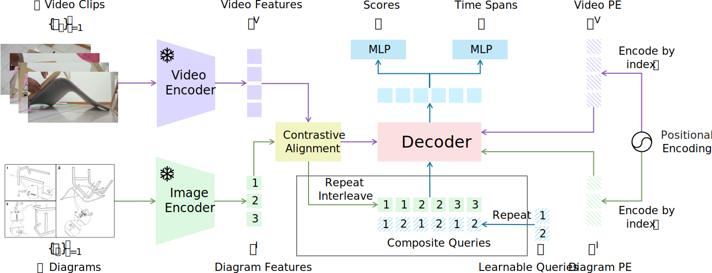

<div align="center">

<h1>Temporal Instructional Diagram Grounding in Unconstrained Videos</h1>

<div>
    <a href='https://academic.davidz.cn' target='_blank'>Jiahao Zhang<sup>1</sup></a>;
    <a href='https://fredzzhang.com' target='_blank'>Frederic Z. Zhang<sup>2</sup></a>;
    <a href='https://crodriguezo.me' target='_blank'>Cristian Rodriguez<sup>2</sup></a>;
    <a href='https://www.itzikbs.com' target='_blank'>Yizhak Ben-Shabat<sup>1,3</sup></a>;
    <a href='https://users.cecs.anu.edu.au/~cherian' target='_blank'>Anoop Cherian<sup>4</sup></a>;
    <a href='https://users.cecs.anu.edu.au/~sgould' target='_blank'>Stephen Gould<sup>1</sup></a>
</div>
<sup>1</sup>The Australian National University
<sup>2</sup>The Australian Institute for Machine Learning
<sup>3</sup>Technion Israel Institute of Technology
<sup>4</sup>Mitsubishi Electric Research Labs

<br>

<div>
    <a href='https://arxiv.org/abs/2407.12066' target='_blank'></a>
    <a href="https://github.com/DavidZhang73/pytorch-lightning-template"></a>
    <a href="LICENSE"></a>
</div>

</div>

## Abstract

We study the challenging problem of simultaneously localizing a sequence of queries in the form of instructional diagrams in a video. This requires understanding not only the individual queries but also their interrelationships. However, most existing methods focus on grounding one query at a time, ignoring the inherent structures among queries such as the general mutual exclusiveness and the temporal order. Consequently, the predicted timespans of different step diagrams may overlap considerably or violate the temporal order, thus harming the accuracy. In this paper, we tackle this issue by simultaneously grounding a sequence of step diagrams. Specifically, we propose composite queries, constructed by exhaustively pairing up the visual content features of the step diagrams and a fixed number of learnable positional embeddings. Our insight is that self-attention among composite queries carrying different content features suppress each other to reduce timespan overlaps in predictions, while the cross-attention corrects the temporal misalignment via content and position joint guidance. We demonstrate the effectiveness of our approach on the IAW dataset for grounding step diagrams and the YouCook2 benchmark for grounding natural language queries, significantly outperforming existing methods while simultaneously grounding multiple queries.

## Method



## Prerequisites

### Installation

```bash
# clone project
git clone https://github.com/DavidZhang73/TDGV.git

# create conda virtual environment
conda create -n TDGV python=3.10
conda activate TDGV

# install pytorch according to the official website https://pytorch.org/get-started/locally/
# Test on PyTorch 2.1.2 only
# conda install pytorch==2.1.2 torchvision==0.16.2 pytorch-cuda=11.8 -c pytorch -c nvidia
conda install pytorch==2.1.2 torchvision==0.16.2 pytorch-cuda=12.1 -c pytorch -c nvidia

# install other requirements
pip install -r requirements.txt

# CD to the project directory
cd TDGV
```

### Data Preparation

Use `huggingface_hub` CLI to download the pre-processed datasets:

```bash
huggingface-cli download --repo-type dataset DavidZhang73/TDGVDatasets --local-dir ./data
```

### Training

Train the model on IAW dataset:

```bash
python src/main.py fit -c configs/iaw_ours_aligned.yaml --trainer.logger.name iaw_ours_aligned
```

Train the model on YouCook2 dataset:

```bash
python src/main.py fit -c configs/youcook2_ours_aligned.yaml --trainer.logger.name youcook2_ours_aligned
```

Train the model on ActivityNet Caption dataset:

```bash
python src/main.py fit -c configs/anet_ours_aligned.yaml --trainer.logger.name anet_ours_aligned
```

## Citation

```
@inproceedings{Zhang2025Temporally,
  title={Temporally Grounding Instructional Diagrams in Unconstrained Videos},
  author={Zhang, Jiahao and Zhang, Frederic Z and Rodriguez, Cristian and Ben-Shabat, Yizhak and Cherian, Anoop and Gould, Stephen},
  booktitle={Winter Conference on Applications of Computer Vision (WACV)},
  year={2025}
}
```
